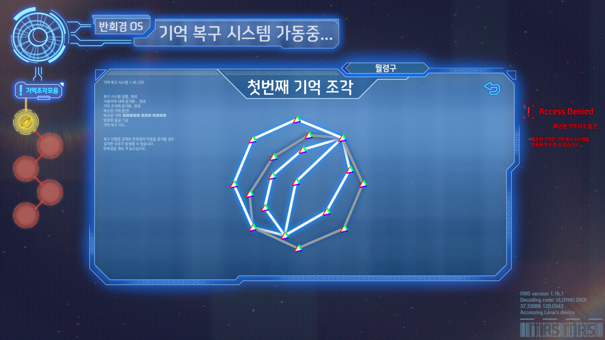

# Visual Novel Game (Unity Portfolio)

이 프로젝트는 Unity Engine과 Naninovel을 활용하여 제작한 비주얼 노벨 장르 게임을 활용한 포트폴리오 자료입니다.  
본 저장소는 포트폴리오 용도로 정리되었으며, 제가 직접 개발한 기능과 UI를 중심으로 구성되어 있습니다.

## 주요 담당 업무
- Unity(C#) 기반으로 **비주얼 노벨에 삽입된 미니게임** 직접 구현  
- 미니게임 종료 직후 재생되는 **애니메이션 연출 및 화면 전환 효과** 제작  
- **뮤직 갤러리 UI**: BGM 재생, 정지, 구간 이동 등을 지원하는 인터페이스 구현  
- **스토리 점프 UI**: 원하는 지점으로 빠르게 이동할 수 있는 이야기 점프 기능 추가  
- **업적 UI**: 플레이어의 진행 상황에 따라 업적 달성 및 보상을 표시하는 시스템 개발  
- DOTween을 활용한 UI 전환 효과
- 프로젝트 빌드 및 최종 패키징

## 사용 기술
- Unity Engine (C#)
- Naninovel
- DOTween

## 실행 화면

## 데모 링크
[DemoLink](https://store.onstove.com/ko/games/3519)

## 참고
- 본 저장소는 전체 게임 리소스는 포함되지 않으며, 프로그래밍의 코드에 관하여 작성했습니다.
